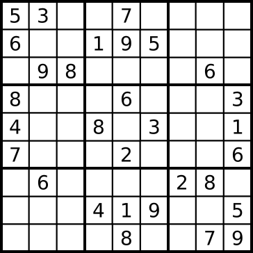
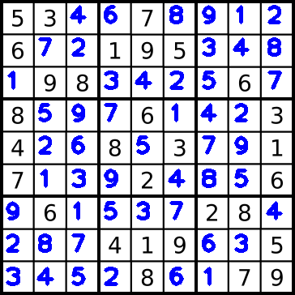

# Sudoku solver
This is a complete code to solve Sudoku puzzles. 

For example, given this image



the solver outputs



## Installation on Ubuntu

1. Install Bazel or better Bazelisk
2. Install OpenCV and Tesseract with included scripts
3. Run ```bazel run //:solver_main -- --image_path=$HOME/sudoku/testdata/sudoku_9_9.png --model_path=$HOME/sudoku/model.yml``` 

## Overview

1. Detects Sudoku grid and extracts 81 digit cells
2. Detects each cell with a simple ML model
3. Solves it through backtracking
4. Puts answers into the same grid

## Dependencies
* OpenCV
* Tesseract
* Abseil
* Glog, Gtest and a few other dev dependencies

If you have any thoughts or questions, [ping me](mailto:stan.bashtavenko@gmail.com). 
